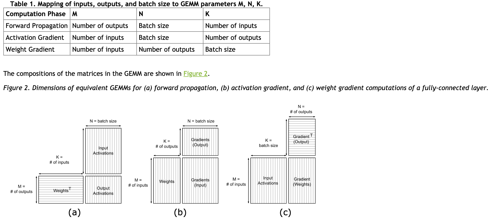

# Deep Learning
Many operations in deep learning model training are especially represented as matrix multiplies and addition.
Even better performance can be achieved by tweaking operation parameters to efficiently use GPU resources.

# Type of Operations
1. Batch size, number of inputs, and number of outputs. 
2. Forward propagation
3. Activation gradient computation
4. Weight gradient computation 
are directly expressed as matrix-matrix multiplications

# Before you start do this first
1. [Matrix Multiplication Background User Guide](https://docs.nvidia.com/deeplearning/performance/dl-performance-matrix-multiplication/index.html)
2. [Tensor Core Requirements](https://docs.nvidia.com/deeplearning/performance/dl-performance-matrix-multiplication/index.html#requirements-tc)
3. [Dimension Quantization Effects](https://docs.nvidia.com/deeplearning/performance/dl-performance-matrix-multiplication/index.html#dim-quantization)
4. [Performance](https://docs.nvidia.com/deeplearning/performance/dl-performance-fully-connected/index.html#performance)
5. [Batch size](https://docs.nvidia.com/deeplearning/performance/dl-performance-fully-connected/index.html#batch-size)
6. [Automatic mixed precision](https://developer.nvidia.com/automatic-mixed-precision)
7. [Training with mixed precision](https://docs.nvidia.com/deeplearning/sdk/mixed-precision-training/index.html)
8. [Channel In and Out](https://docs.nvidia.com/deeplearning/sdk/dl-performance-guide/index.html#channels)
9. [Limited memory layer](https://docs.nvidia.com/deeplearning/sdk/dl-performance-guide/index.html#mem-limited)
10. [GPU efficiency](https://docs.nvidia.com/deeplearning/sdk/dl-performance-guide/index.html#gpu-perf)
11. [Tilling](https://docs.nvidia.com/deeplearning/sdk/dl-performance-guide/index.html#cublas-tile-dim)
12. [Quantization](https://docs.nvidia.com/deeplearning/sdk/dl-performance-guide/index.html#dim-quantization)
13. [Quantization to CNN](https://docs.nvidia.com/deeplearning/sdk/dl-performance-guide/index.html#quant-effects)
14. [Convolution optimization](https://docs.nvidia.com/deeplearning/performance/dl-performance-convolutional/index.html)
15. [In Math-Limited Regime Where Possible](https://docs.nvidia.com/deeplearning/performance/dl-performance-memory-limited/index.html)
16. [Mixed precision is another option](https://docs.nvidia.com/deeplearning/performance/mixed-precision-training/index.html)

# [Some optimization](https://developer.nvidia.com/blog/optimizing-gpu-performance-tensor-cores/)
1. [Optimizing gpu performance using tensor cores](https://developer.nvidia.com/blog/optimizing-gpu-performance-tensor-cores/)
    * Padding the vocabulary size to the next multiple of 8 (for FP16 data) or 16 (for INT8 data) activates Tensor Cores
    * A fully-connected layer with a batch size and number of inputs and outputs that follow this rule will use Tensor Cores, as will a convolutional layer with a number of input and output channels that do the same.
    * Choosing Batch Size for Tensor Cores
    * Padding The Vocabulary Size
    * Choosing Multiple-Of-8 Batch Sizes
    * Avoiding Wave Quantization Through Batch Size Choice
2. [Considering Quantization Effects](https://docs.nvidia.com/deeplearning/sdk/dl-performance-guide/index.html#dim-quantization)
    * parallel computations as threads, grouped into thread blocks, responsible for a subset of the calculations being done
    * GPU executes a task, it is split into equally-sized thread blocks
    * GPU divides the output matrix into uniformly-sized, rectangular tiles
    * Each tile is computed by a thread block
    * not all output matrices divide evenly into an available tile size. Further, the thread blocks created may not divide evenly among the multiprocessors on the GPU. These effects, called tile quantization and wave quantization respectively, can lead to wasted cycles and inefficiency.
    * Tile quantization occurs when one dimension of the output matrix is not evenly divisible by the corresponding tile dimension. 
    * While the cuBLAS library tries to choose the best tile size available, most tile sizes are powers of 2
    * To avoid tile quantization, choose parameters that are divisible by powers of 2 (at least 64 and ideally 256, to account for the most common tile sizes).
    * On a GPU with 8 SMs, a task with 12 thread blocks will be split into a wave of 8 thread blocks (occupying all SMs) and a tail wave of 4 thread blocks (occupying only 50% of SMs). Thus, overall GPU utilization for the task will be 75% at best.
    * A GPU has 80 multiprocessors and a tile size of 256×128
3. [Mixed precision is another option](https://docs.nvidia.com/deeplearning/performance/mixed-precision-training/index.html)

4. [In Math-Limited Regime Where Possible](https://docs.nvidia.com/deeplearning/performance/dl-performance-memory-limited/index.html)
    * Data movement speed can also limit achievable performance
    * If the speed of a routine is limited by calculation rate (math-limited or math-bound), performance can be improved by enabling Tensor Cores
    * If a routine is limited by the time taken to load inputs and write outputs (bandwidth-limited or memory-bound) speeding up calculation does not improve performance. For fully-connected and convolutional layers, this occurs mostly when one or more parameters of a layer are small.
5. [Fully-Connected Layer](https://docs.nvidia.com/deeplearning/performance/dl-performance-fully-connected/index.html#checklist)
Fully-connected layers, which connect every input neuron to every output neuron, are commonly used in neural networks.

6. [Convolution optimization](https://docs.nvidia.com/deeplearning/performance/dl-performance-convolutional/index.html)
7. [Recurrent layer](https://docs.nvidia.com/deeplearning/performance/dl-performance-recurrent/index.html#checklist)
8. [Memory limited layer](https://docs.nvidia.com/deeplearning/performance/dl-performance-memory-limited/index.html#checklist)